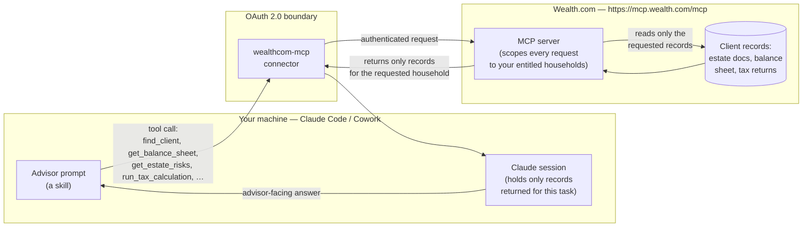

# Security & Data Flow

This plugin ships a remote MCP server (`wealthcom-mcp`, `https://mcp.wealth.com/mcp`) that serves **live, sensitive advisor client data** — estate documents, balance sheets, and filed federal and state tax returns.

Because it is a remote, third-party server, Claude Code and Cowork display a standing notice that they cannot verify MCP servers they do not operate. **This notice fires for any remote connector** and does not indicate a problem with this plugin. This document describes what the connection actually does so you can review it before installing.

---

## Authentication

The `wealthcom-mcp` connector authenticates over **OAuth 2.0**, using an `authenticate` / `complete_authentication` flow. Claude Code and Cowork never see or store your Wealth.com password — they hold only the scoped access token the OAuth flow returns.

The skills do nothing until this connector is authorized for your account.

## Transport

Claude reaches the connector over HTTPS at `https://mcp.wealth.com/mcp`. The MCP server is remote and hosted by Wealth.com.

## What this repository contains

This repository ships Skills (`skills/`) and connector configuration (`.mcp.json`) only. It contains no client data, no credentials, and no secrets.

---

## Data flow

The diagram below shows where data lives and what crosses the boundary into a Claude session. Everything to the right of the boundary stays on Wealth.com unless a skill explicitly requests it.

### What stays on Wealth.com

- The full client database. Records are read on demand and only the ones a tool call requests are returned.
- Any client, household, or document your account is **not** entitled to.
- Internal identifiers, schema, and raw extraction data (the server returns advisor-facing figures, not internal structure).

### What enters the Claude session

- Only the specific records needed to answer the current prompt — e.g. one household's balance sheet, or one filed return — for the duration of that session.
- These records live in the session like any other conversation content; they are not written back to Wealth.com by the plugin.

---

## Tenant & household scoping

Requests are scoped to the households your Wealth.com account is entitled to; the connector does not surface other advisors' or other tenants' clients.

The precise enforcement model is maintained by Wealth.com and should be confirmed against current infrastructure before publishing:

- **[CONFIRM: mechanism that scopes each MCP request to the authenticated advisor's entitled households — e.g. token claims, per-advisor entitlement checks on every tool call.]**
- **[CONFIRM: cross-tenant isolation guarantee — how one advisory firm's / tenant's data is prevented from being returned to another.]**
- **[CONFIRM: whether household access is further limited within a firm (per-advisor vs. firm-wide visibility).]**

---

## Data handling by Wealth.com

The following are Wealth.com operational facts that are **not** verifiable from this repository and must be confirmed by Wealth.com before being stated publicly:

- **[CONFIRM: OAuth scopes the connector requests, and what each grants access to.]**
- **[CONFIRM: encryption in transit (TLS version) and at rest for data served by mcp.wealth.com.]**
- **[CONFIRM: retention — how long, if at all, request/response data is logged or stored server-side.]**
- **[CONFIRM: whether client data is or is not used to train any model.]**
- **[CONFIRM: relevant compliance posture, e.g. SOC 2 Type II, if any is to be cited — state factually, only if the report is held.]**

Do not fill these in without confirmation from Wealth.com.

---

## Reporting a concern

**[CONFIRM: security contact / disclosure process for reporting an issue in this plugin or the connector.]**
